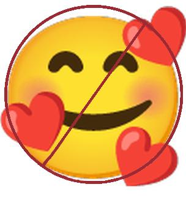
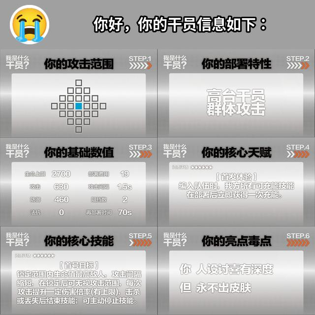

# 表情列表

按照表情的 `key` 排列

1. [can_can_need (看看你的)](#can_can_need)
2. [do (撅/狠狠地撅)](#do)
3. [forbid (禁止/禁)](#forbid)
4. [operator_generator (合成大干员)](#operator_generator)

## can_can_need

- 关键词：`看看你的`
- 需要图片数目：`2`
- 需要文字数目：`0`
- 预览：

  

## do

- 关键词：`撅`、`狠狠地撅`
- 需要图片数目：`2`
- 需要文字数目：`0`
- 预览：

  

## forbid

- 关键词：`禁止`、`禁`
- 需要图片数目：`1`
- 需要文字数目：`0`
- 预览：

  

## operator_generator

- 关键词：`合成大干员`
- 需要图片数目：`1`
- 需要文字数目：`0` ~ `1`
- 预览：

  

