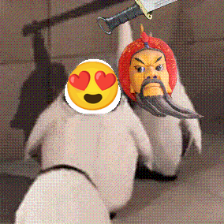
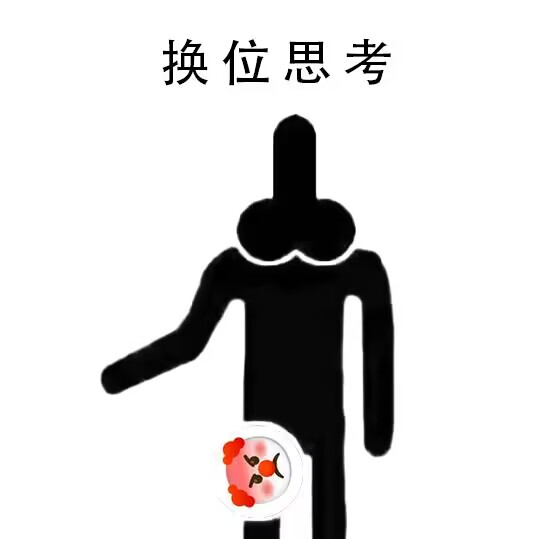
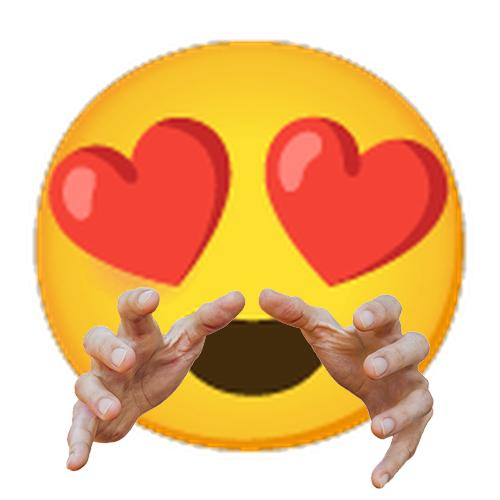

# 表情列表

按照表情的 `key` 排列

1. [behead (砍头/斩首)](#behead)
2. [can_can_need (看看你的)](#can_can_need)
3. [do (撅/狠狠地撅)](#do)
4. [empathy (换位思考)](#empathy)
5. [fleshlight (飞机杯)](#fleshlight)
6. [forbid (禁止/禁)](#forbid)
7. [grab (抓)](#grab)
8. [operator_generator (合成大干员)](#operator_generator)
9. [stretch (双手/伸展)](#stretch)

## behead

- 关键词：`砍头`、`斩首`
- 需要图片数目：`1`
- 需要文字数目：`0`
- 预览：

  

## can_can_need

- 关键词：`看看你的`
- 需要图片数目：`2`
- 需要文字数目：`0`
- 预览：

  

## do

- 关键词：`撅`、`狠狠地撅`
- 需要图片数目：`2`
- 需要文字数目：`0`
- 预览：

  

## empathy

- 关键词：`换位思考`
- 需要图片数目：`1`
- 需要文字数目：`0`
- 预览：

  

## fleshlight

- 关键词：`飞机杯`
- 需要图片数目：`1`
- 需要文字数目：`0`
- 预览：

  

## forbid

- 关键词：`禁止`、`禁`
- 需要图片数目：`1`
- 需要文字数目：`0`
- 预览：

  

## grab

- 关键词：`抓`
- 需要图片数目：`1`
- 需要文字数目：`0`
- 预览：

  

## operator_generator

- 关键词：`合成大干员`
- 需要图片数目：`1`
- 需要文字数目：`0` ~ `1`
- 预览：

  

## stretch

- 关键词：`双手`、`伸展`
- 需要图片数目：`1`
- 需要文字数目：`0`
- 预览：

  

